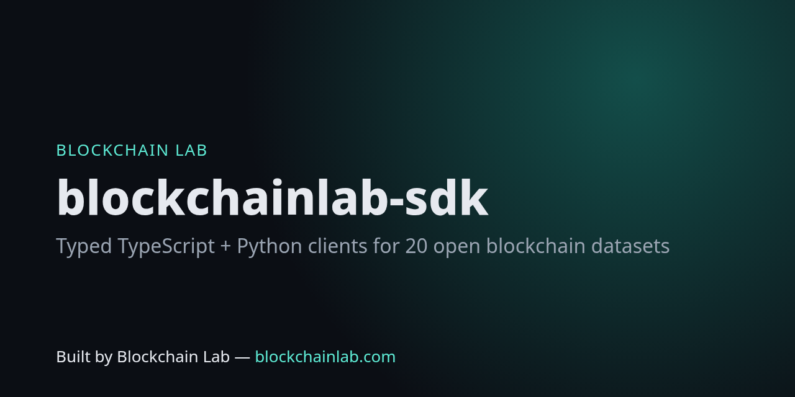

# blockchainlab-sdk



**Typed TypeScript + Python clients for the [Blockchain Lab Open Data API](https://blockchains.github.io/blockchainlab-api/)** — 20 free, versioned, nightly-rebuilt datasets: EVM chains & RPCs, DeFi TVL, stablecoins, yields, bridges, DEX volumes, protocol fees, L2BEAT L2 metrics, security incidents (hacks), OFAC-sanctioned addresses, public RPC health, EIPs/ERCs/BIPs, whitepapers, grants, hackathons.

> Built by **Blockchain Lab — [blockchainlab.com](https://blockchainlab.com/?utm_source=github&utm_medium=readme&utm_campaign=blockchainlab-sdk)**

Types are **generated from the API's JSON Schemas** (`scripts/gen.py`); CI regenerates them daily and fails if the API drifted, and the live test suite hits every dataset in production (no mocks).

## TypeScript / JavaScript (Node ≥ 18, browsers, Deno, Bun)

```bash
npm i github:Blockchains/blockchainlab-sdk
```

```ts
import { BlockchainLab } from "blockchainlab-sdk";
const bl = new BlockchainLab();
const usdc = await bl.stablecoin("USDC");               // StablecoinsRow | null
const base = await bl.l2("base");                       // stage, TVS breakdown, risks (L2BEAT)
const rpcs = await bl.healthyRpcs("ethereum");          // fastest healthy public RPCs
const hacks = await bl.incidents({ since: "2026-01-01", minUsd: 1e7 });
const flagged = await bl.isSanctioned("0x…");           // OFAC SDN list
const { data, generated_at } = await bl.dataset("dex-volumes"); // fully typed by name
```

## Python (3.9+, standard library only)

```bash
pip install "git+https://github.com/Blockchains/blockchainlab-sdk#subdirectory=python"
```

```python
from blockchainlab_sdk import BlockchainLab
bl = BlockchainLab()
print(bl.stablecoin("USDT")["circulating"])
for y in bl.top_yields(stablecoin_only=True, limit=5): print(y["project"], y["symbol"], y["apy"])
print(bl.l2("arbitrum")["stage"], bl.is_sanctioned("0x…"))
```

## Datasets

`bips` · `bridges` · `chains` · `chains-tvl` · `dex-volumes` · `eips` · `ercs` · `events` · `fees` · `glossary` · `grants` · `hackathons` · `l2-metrics` · `protocols` · `rpc-health` · `sanctioned-addresses` · `security-incidents` · `stablecoins` · `whitepapers` · `yields` — see the [catalogue](https://blockchains.github.io/blockchainlab-api/v1/index.json), [OpenAPI](https://blockchains.github.io/blockchainlab-api/openapi.yaml) and [changelog/versioning](https://github.com/Blockchains/blockchainlab-api/blob/main/CHANGELOG.md).

## Versioning & releases

SDK version tracks the API `schema_version` (1.1.x ↔ API schema 1.1). The client warns if the server's schema major differs. Pushing a `v*` tag builds the npm tarball and Python wheel and attaches them to a GitHub Release. Registry publishing (npm / PyPI) is a deliberate manual step: `cd ts && npm publish` / `python -m build python && twine upload dist/*`.

## Related

[Blockchain Lab hub](https://blockchains.github.io/) · [Tools (26)](https://blockchains.github.io/blockchainlab-tools/) · [MCP server](https://github.com/Blockchains/blockchainlab-mcp) · [Labs](https://github.com/Blockchains/blockchainlab-labs)

MIT. Data belongs to each named source — attribute the source and Blockchain Lab.
